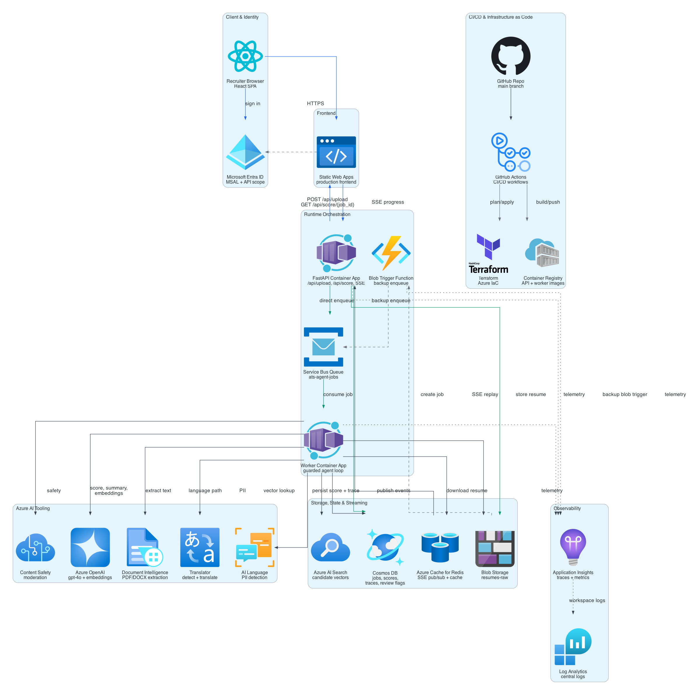

# AI-ATS-RESUME-AGENT


AI-powered Applicant Tracking System (ATS) Resume Screening Agent. Accepts PDF/DOCX resume uploads and job descriptions, runs a guarded agentic reasoning loop using Azure OpenAI function calling, streams agent progress via Server-Sent Events (SSE), and produces recruiter-readable ATS reports.

## Architecture Overview



The diagram above shows the cost-optimized production runtime path: Static Web Apps calls the FastAPI Container App directly, the API stores the resume and enqueues work on Service Bus, and the worker runs the guarded agent loop against Azure AI services before persisting scores, traces, and review state. API Management and Front Door remain optional/dev-only infrastructure paths documented below.

Diagram source: [`docs/architecture_diagram.py`](docs/architecture_diagram.py), generated with the [Diagrams](https://github.com/mingrammer/diagrams) library.

**Data flow:**

1. Recruiter signs in via Microsoft Entra ID.
2. SPA sends `POST /api/upload` (through APIM in dev; directly in cost-optimized production) with file + job description.
3. FastAPI validates, creates a job record, uploads the resume blob, **enqueues a Service Bus message directly**.
4. The blob trigger Function serves as a backup path (Consumption plan blob polling can take minutes).
5. The worker receives the message, runs the guarded agent, streams SSE events, persists results.
6. The frontend uses SSE for real-time progress and polls `GET /api/score/{job_id}` as a completion fallback.

## What Makes This a Guarded Agent

This is **not a hardcoded pipeline** and **not an unrestricted AI agent**. The system uses a **guarded agent** architecture:

- **The model chooses tools and arguments** through Azure OpenAI function calling each turn.
- **The runtime enforces safety and completeness invariants** the model cannot override:

  - `extract_resume_text` must complete before any tool needing resume text.
  - `check_pii_and_safety` must complete before scoring, embedding, or summary.
  - Non-English resumes require translation or human review flag.
  - `score_resume`, `compute_semantic_similarity`, `generate_fit_summary` must all complete.
  - Auto-flag for human review when: score < 30, confidence < 0.6, safety flagged, extraction confidence low, max iterations hit (12), or missing required fields.
  - Max 2 retries per tool call. Max 12 iterations per job.
  - All tool I/O validated against Pydantic models.
  - Raw resume text never persisted in logs or traces.

## The 9 Canonical Agent Tools

| # | Tool | Azure Service | Purpose |
|---|------|---------------|---------|
| 1 | `extract_resume_text` | Document Intelligence | Extract text from PDF/DOCX |
| 2 | `detect_language` | Translator | Detect resume language |
| 3 | `translate_text` | Translator | Translate non-English text to English |
| 4 | `check_pii_and_safety` | AI Language + Content Safety | PII redaction + harmful content check |
| 5 | `score_resume` | Azure OpenAI | Score 0–100 (40 keyword + 30 experience + 30 skills) |
| 6 | `compute_semantic_similarity` | OpenAI Embeddings + Redis | JD/resume semantic similarity with cache |
| 7 | `search_similar_candidates` | AI Search | Vector search across historical embeddings |
| 8 | `flag_for_human_review` | Cosmos DB | Write review flag for low scores or issues |
| 9 | `generate_fit_summary` | Azure OpenAI | 2–3 sentence plain-English recruiter summary |

> `get_embedding` and `search_similar_jds` are obsolete aliases. The canonical names above are the only valid tool identifiers.

## Setup Prerequisites

- **Azure CLI** — `az` command-line tool, logged in
- **Terraform** >= 1.6
- **Docker** — for building backend images
- **Node.js** 20+
- **Python** 3.11+
- **GitHub OIDC** — Federated identity configured for GitHub Actions (see [Terraform deployment steps](#terraform-deployment))

## Local Development

### Backend

```bash
cd backend
python -m venv .venv
source .venv/bin/activate
pip install -r requirements.in

# Required environment variable (placeholder for local testing):
export AZURE_OPENAI_ENDPOINT="https://placeholder.openai.azure.com/"

# Run the API (from repo root):
uvicorn backend.app.main:create_app --factory --reload --port 8000

# Run tests (all Azure/OpenAI clients are mocked):
pytest tests/ -v
```

### Frontend

```bash
cd frontend
npm install
npm run dev          # Vite dev server with API proxy to localhost:8000
npm run typecheck    # TypeScript check
npm test             # Vitest (22 tests)
npm run build        # Production build
```

### Worker (local)

```bash
cd backend
# The worker requires a Service Bus connection for production mode.
# For local testing, use the async iterator interface in tests.
pytest tests/test_worker.py -v
```

## Production Deployment Runbook

This runbook is the path for a clean deployment from GitHub Actions to the cost-optimized production environment. It assumes a fresh clone, an Azure subscription with the required providers registered, and `az`, `gh`, `terraform`, `docker`, Node.js 20+, and Python 3.11+ available locally.

### 1. Set Operator Variables

```bash
export REPO="Heeyaichen/ai-ats-resume-agent"
export SUBSCRIPTION_ID="<azure-subscription-id>"
export LOCATION="swedencentral"
export TF_STATE_RESOURCE_GROUP="ats-agent-tfstate-rg"
export TF_STATE_STORAGE_ACCOUNT="atsagenttfstate001az"
export TF_STATE_CONTAINER="tfstate"

az account set --subscription "$SUBSCRIPTION_ID"
export TENANT_ID="$(az account show --query tenantId -o tsv)"
```

### 2. Create GitHub Environments

The workflows use environment-scoped secrets and variables.

```bash
gh api --method PUT "repos/${REPO}/environments/dev"
gh api --method PUT "repos/${REPO}/environments/production"
```

| Environment | Used by | Purpose |
|-------------|---------|---------|
| `dev` | Terraform PR validation | `terraform plan` against `env/dev.tfvars` |
| `production` | Main-branch deploys | Terraform apply, backend deploy, frontend deploy |

### 3. Configure GitHub OIDC for Azure

Create one Entra app registration for GitHub Actions and grant it access to the subscription. `Contributor` is enough for most resources; `User Access Administrator` is required if Terraform creates or updates RBAC assignments.

```bash
export GITHUB_APP_NAME="ats-agent-github-actions"

export AZURE_CLIENT_ID="$(az ad app create \
  --display-name "$GITHUB_APP_NAME" \
  --query appId \
  -o tsv)"

az ad sp create --id "$AZURE_CLIENT_ID"

export APP_OBJECT_ID="$(az ad app show --id "$AZURE_CLIENT_ID" --query id -o tsv)"

az role assignment create \
  --assignee "$AZURE_CLIENT_ID" \
  --role Contributor \
  --scope "/subscriptions/${SUBSCRIPTION_ID}"

az role assignment create \
  --assignee "$AZURE_CLIENT_ID" \
  --role "User Access Administrator" \
  --scope "/subscriptions/${SUBSCRIPTION_ID}"
```

Add federated credentials for both GitHub environments:

```bash
cat > /tmp/ats-agent-gh-dev-oidc.json <<EOF
{
  "name": "github-dev-environment",
  "issuer": "https://token.actions.githubusercontent.com",
  "subject": "repo:${REPO}:environment:dev",
  "audiences": ["api://AzureADTokenExchange"]
}
EOF

cat > /tmp/ats-agent-gh-production-oidc.json <<EOF
{
  "name": "github-production-environment",
  "issuer": "https://token.actions.githubusercontent.com",
  "subject": "repo:${REPO}:environment:production",
  "audiences": ["api://AzureADTokenExchange"]
}
EOF

az ad app federated-credential create --id "$APP_OBJECT_ID" --parameters @/tmp/ats-agent-gh-dev-oidc.json
az ad app federated-credential create --id "$APP_OBJECT_ID" --parameters @/tmp/ats-agent-gh-production-oidc.json
```

### 4. Bootstrap Terraform Remote State

Terraform state storage must exist before the first CI run.

```bash
az group create \
  --name "$TF_STATE_RESOURCE_GROUP" \
  --location "$LOCATION"

az storage account create \
  --name "$TF_STATE_STORAGE_ACCOUNT" \
  --resource-group "$TF_STATE_RESOURCE_GROUP" \
  --location "$LOCATION" \
  --sku Standard_LRS \
  --kind StorageV2

az storage container create \
  --name "$TF_STATE_CONTAINER" \
  --account-name "$TF_STATE_STORAGE_ACCOUNT" \
  --auth-mode login
```

### 5. Set Required GitHub Environment Secrets

Set the Azure auth and Terraform backend secrets in both `dev` and `production`:

```bash
for ENVIRONMENT in dev production; do
  printf "%s" "$AZURE_CLIENT_ID" | gh secret set AZURE_CLIENT_ID --env "$ENVIRONMENT" --repo "$REPO"
  printf "%s" "$TENANT_ID" | gh secret set AZURE_TENANT_ID --env "$ENVIRONMENT" --repo "$REPO"
  printf "%s" "$SUBSCRIPTION_ID" | gh secret set AZURE_SUBSCRIPTION_ID --env "$ENVIRONMENT" --repo "$REPO"
  printf "%s" "$TF_STATE_RESOURCE_GROUP" | gh secret set TF_STATE_RESOURCE_GROUP --env "$ENVIRONMENT" --repo "$REPO"
  printf "%s" "$TF_STATE_STORAGE_ACCOUNT" | gh secret set TF_STATE_STORAGE_ACCOUNT --env "$ENVIRONMENT" --repo "$REPO"
  printf "%s" "$TF_STATE_CONTAINER" | gh secret set TF_STATE_CONTAINER --env "$ENVIRONMENT" --repo "$REPO"
done
```

### 6. Review Cost-Optimized Production Variables

Review `infra/env/prod.tfvars` before applying. The current production profile is intentionally cost-optimized:

- `enable_apim=false`
- `enable_frontdoor=false`
- `search_sku="free"`
- `static_web_app_sku="Free"`
- `redis_sku="Basic"`
- `use_existing_openai=true`
- `existing_cae_id` points to the shared Container Apps Environment when subscription quota requires it
- `cors_origins` includes the production Static Web Apps URL and localhost

For a fully isolated production environment, use a subscription with sufficient quotas and replace the shared OpenAI/CAE settings.

### 7. Run Production Terraform Plan and Apply

Manual first deploy:

```bash
cd infra

terraform init \
  -backend-config="resource_group_name=${TF_STATE_RESOURCE_GROUP}" \
  -backend-config="storage_account_name=${TF_STATE_STORAGE_ACCOUNT}" \
  -backend-config="container_name=${TF_STATE_CONTAINER}" \
  -backend-config="key=prod.tfstate"

terraform fmt -recursive -check
terraform validate
terraform plan -var-file=env/prod.tfvars -out=prod.tfplan
terraform apply prod.tfplan
```

Capture deployment outputs:

```bash
terraform output
export RESOURCE_GROUP_NAME="$(terraform output -raw resource_group_name)"
export ACR_NAME="$(terraform output -raw acr_name)"
export API_CONTAINER_APP_NAME="$(terraform output -raw api_container_app_name)"
export WORKER_CONTAINER_APP_NAME="$(terraform output -raw worker_container_app_name)"
export FUNCTION_APP_NAME="$(terraform output -raw function_app_name)"
export STATIC_WEB_APP_NAME="$(terraform output -raw static_web_app_name)"
export API_URL="https://$(terraform output -raw api_url)"
export SWA_URL="https://$(terraform output -raw static_web_app_url)"
```

### 8. Set Production Deploy Secrets

The backend workflow needs compute resource names from Terraform outputs:

```bash
printf "%s" "$ACR_NAME" | gh secret set ACR_NAME --env production --repo "$REPO"
printf "%s" "$API_CONTAINER_APP_NAME" | gh secret set API_CONTAINER_APP_NAME --env production --repo "$REPO"
printf "%s" "$WORKER_CONTAINER_APP_NAME" | gh secret set WORKER_CONTAINER_APP_NAME --env production --repo "$REPO"
printf "%s" "$FUNCTION_APP_NAME" | gh secret set FUNCTION_APP_NAME --env production --repo "$REPO"
printf "%s" "$RESOURCE_GROUP_NAME" | gh secret set RESOURCE_GROUP_NAME --env production --repo "$REPO"
```

The frontend workflow needs the Static Web Apps deployment token:

```bash
export SWA_TOKEN="$(az staticwebapp secrets list \
  --name "$STATIC_WEB_APP_NAME" \
  --resource-group "$RESOURCE_GROUP_NAME" \
  --query 'properties.apiKey' \
  -o tsv)"

printf "%s" "$SWA_TOKEN" | gh secret set AZURE_STATIC_WEB_APPS_API_TOKEN --env production --repo "$REPO"
unset SWA_TOKEN
```

### 9. Configure Frontend Auth Variables

The Vite variables are public browser configuration, so they are GitHub environment variables, not secrets.

Use the app registration configured for SPA sign-in and API scope:

```bash
export FRONTEND_CLIENT_ID="<spa-app-registration-client-id>"
export API_SCOPE="api://${FRONTEND_CLIENT_ID}/access_as_user"

gh variable set VITE_AZURE_CLIENT_ID --env production --repo "$REPO" --body "$FRONTEND_CLIENT_ID"
gh variable set VITE_AZURE_AUTHORITY --env production --repo "$REPO" --body "https://login.microsoftonline.com/${TENANT_ID}"
gh variable set VITE_API_SCOPE --env production --repo "$REPO" --body "$API_SCOPE"
gh variable set VITE_API_BASE_URL --env production --repo "$REPO" --body "${API_URL}/api"
```

The SPA app registration must include the production redirect URI:

```bash
az ad app update \
  --id "$FRONTEND_CLIENT_ID" \
  --spa-redirect-uris \
    "http://localhost:5173" \
    "$SWA_URL"
```

If the `access_as_user` scope does not exist yet, create it in Microsoft Entra ID:

`App registrations -> your SPA/API app -> Expose an API -> Application ID URI api://<client-id> -> Add scope access_as_user`.

### 10. Trigger CI/CD Deployment

The workflows are path-filtered:

- Changes under `infra/**` trigger Terraform apply.
- Changes under `backend/**` trigger API/worker image build and Function deploy.
- Changes under `frontend/**` trigger frontend deploy.
- Frontend can also be redeployed manually with `workflow_dispatch`.

After merging to `main`, monitor:

```bash
gh run list --repo "$REPO" --branch main --limit 10
gh run watch <run-id> --repo "$REPO"
```

Manual frontend redeploy:

```bash
gh workflow run "Frontend CI/CD" --repo "$REPO" --ref main
```

Manual first runtime deploy when no backend change is being pushed:

```bash
# API image
cd backend
az acr login --name "$ACR_NAME"
export IMAGE_TAG="$(git rev-parse --short HEAD)"
export API_IMAGE="${ACR_NAME}.azurecr.io/ats-agent-api:${IMAGE_TAG}"
docker build --target api -t "$API_IMAGE" .
docker push "$API_IMAGE"
az containerapp update \
  --name "$API_CONTAINER_APP_NAME" \
  --resource-group "$RESOURCE_GROUP_NAME" \
  --image "$API_IMAGE"

# Worker image
export WORKER_IMAGE="${ACR_NAME}.azurecr.io/ats-agent-worker:${IMAGE_TAG}"
docker build --target worker -t "$WORKER_IMAGE" .
docker push "$WORKER_IMAGE"
az containerapp update \
  --name "$WORKER_CONTAINER_APP_NAME" \
  --resource-group "$RESOURCE_GROUP_NAME" \
  --image "$WORKER_IMAGE"

# Function backup trigger
rm -rf /tmp/function-zip /tmp/function-app.zip
mkdir -p /tmp/function-zip
cp function_trigger/function_app.py /tmp/function-zip/
cp function_trigger/host.json /tmp/function-zip/
cp function_trigger/requirements.txt /tmp/function-zip/
cd /tmp/function-zip
zip -r /tmp/function-app.zip .
az functionapp deployment source config-zip \
  --name "$FUNCTION_APP_NAME" \
  --resource-group "$RESOURCE_GROUP_NAME" \
  --src /tmp/function-app.zip \
  --build-remote true

# Frontend production deploy through GitHub Actions
cd -
gh workflow run "Frontend CI/CD" --repo "$REPO" --ref main
```

If a workflow fails for a transient Azure deployment issue, rerun it:

```bash
gh run rerun <run-id> --repo "$REPO"
```

### 11. Production Smoke Test

Verify infrastructure health:

```bash
curl -s "${API_URL}/api/health"
curl -s -o /dev/null -w "%{http_code}\n" "$SWA_URL"

az containerapp show \
  --name "$API_CONTAINER_APP_NAME" \
  --resource-group "$RESOURCE_GROUP_NAME" \
  --query "{name:name,latestRevision:properties.latestRevisionName,ready:properties.latestReadyRevisionName}" \
  -o table

az containerapp show \
  --name "$WORKER_CONTAINER_APP_NAME" \
  --resource-group "$RESOURCE_GROUP_NAME" \
  --query "{name:name,latestRevision:properties.latestRevisionName,ready:properties.latestReadyRevisionName}" \
  -o table

az functionapp function list \
  --name "$FUNCTION_APP_NAME" \
  --resource-group "$RESOURCE_GROUP_NAME" \
  -o table
```

Verify the frontend production bundle has auth config baked in:

```bash
curl -s "$SWA_URL" -o /tmp/ats-index.html
export JS_ASSET="$(grep -o '/assets/[^"]*\.js' /tmp/ats-index.html | head -1)"
curl -s "${SWA_URL}${JS_ASSET}" -o /tmp/ats-app.js
grep -q "$FRONTEND_CLIENT_ID" /tmp/ats-app.js
grep -q "$API_SCOPE" /tmp/ats-app.js
grep -q "${API_URL}/api" /tmp/ats-app.js
```

### 12. Browser UAT Checklist

Use the production Static Web Apps URL:

```bash
open "$SWA_URL"
```

Validate the full user path:

1. Microsoft sign-in opens and completes successfully.
2. The app shows **AI-ATS-Resume Scoring agent** after sign-in.
3. Upload a real PDF or DOCX resume.
4. Paste a realistic job description.
5. Click **Screen Resume**.
6. Confirm the progress panel receives agent events or the polling fallback completes the job.
7. Confirm the report renders:
   - score out of 100
   - keyword, experience, skills, and semantic similarity breakdown
   - matched keywords
   - missing keywords
   - fit summary
   - privacy / PII badge
   - human review banner only when the agent flags a real review condition
8. Click **Screen Another Resume** and confirm the form resets.

### 13. UAT Diagnostics

If the UI shows `Authentication is not configured`, the frontend was built without `VITE_AZURE_CLIENT_ID`. Recheck production environment variables and rerun the frontend workflow.

If upload fails with CORS, confirm:

```bash
az containerapp show \
  --name "$API_CONTAINER_APP_NAME" \
  --resource-group "$RESOURCE_GROUP_NAME" \
  --query "properties.template.containers[0].env[?name=='CORS_ORIGINS']"
```

`CORS_ORIGINS` must include the production SWA origin.

If the UI stays on processing, verify worker logs:

```bash
az containerapp logs show \
  --name "$WORKER_CONTAINER_APP_NAME" \
  --resource-group "$RESOURCE_GROUP_NAME" \
  --tail 100
```

If the Function backup trigger is delayed, sync triggers:

```bash
az resource invoke-action \
  --action syncfunctiontriggers \
  --ids "/subscriptions/${SUBSCRIPTION_ID}/resourceGroups/${RESOURCE_GROUP_NAME}/providers/Microsoft.Web/sites/${FUNCTION_APP_NAME}"
```

The primary path is API direct enqueue to Service Bus; the blob trigger is a backup path.

### API Management Note

APIM is provisioned by Terraform (Developer SKU in dev) but does not yet enforce API policy (JWT validation, rate limiting, request forwarding to the FastAPI backend). The FastAPI Container App is publicly accessible via its external ingress. APIM policy configuration is a follow-up task after initial deployment.

### Cost-Optimized Production Constraints

The production environment is configured for cost control on a subscription with limited quotas. The following constraints apply:

| Constraint | Dev | Cost-Optimized Production | Reason |
|------------|-----|---------------------------|--------|
| Azure OpenAI | Dedicated (`ats-agent-dev-openai`) | Shares dev OpenAI account | 1 OpenAI account per subscription |
| Container Apps Environment | Dedicated (`ats-agent-dev-cae`) | Shares dev CAE | 1 CAE per region per subscription |
| API Management | Enabled (Developer SKU) | Disabled (`enable_apim=false`) | APIM creation blocked on free trial |
| AI Search | Basic SKU | Free SKU | Basic unavailable in swedencentral |
| Function trigger latency | Consumption (2–10 min scan) | Direct SB enqueue bypasses delay | Blob trigger is backup path only |

These are controlled via `infra/env/prod.tfvars` toggles: `use_existing_openai`, `existing_cae_id`, `enable_apim`, and `search_sku`. This configuration prioritizes deployability and cost control over full environment isolation. For a production deployment with full isolation, request subscription quota increases or use a pay-as-you-go subscription.

## Environment Variable Reference

| Variable | Required | Default | Description |
|----------|----------|---------|-------------|
| `AZURE_OPENAI_ENDPOINT` | Yes | — | Azure OpenAI resource endpoint URL |
| `AZURE_OPENAI_KEY` | No* | — | API key (omit when using managed identity) |
| `CHAT_MODEL_DEPLOYMENT_NAME` | No | `gpt-4o` | Chat model deployment name |
| `EMBEDDING_MODEL_DEPLOYMENT_NAME` | No | `text-embedding-ada-002` | Embedding model deployment name |
| `OPENAI_API_VERSION` | No | `2024-06-01` | Azure OpenAI API version |
| `DOCUMENT_INTELLIGENCE_ENDPOINT` | No | — | Document Intelligence endpoint |
| `TRANSLATOR_ENDPOINT` | No | — | Translator endpoint |
| `TRANSLATOR_REGION` | No | — | Translator region (e.g. `swedencentral`) |
| `LANGUAGE_ENDPOINT` | No | — | AI Language endpoint |
| `CONTENT_SAFETY_ENDPOINT` | No | — | Content Safety endpoint |
| `COSMOS_ENDPOINT` | No | — | Cosmos DB account endpoint |
| `COSMOS_KEY` | No | — | Cosmos DB primary key |
| `COSMOS_DATABASE_NAME` | No | `ats-db` | Cosmos database name |
| `STORAGE_CONNECTION_STRING` | No | — | Blob Storage connection string |
| `REDIS_URL` | No | — | Redis connection URL |
| `SEARCH_ENDPOINT` | No | — | AI Search endpoint |
| `SEARCH_INDEX_NAME` | No | `candidate-embeddings` | AI Search index name |
| `SERVICEBUS_CONNECTION_STRING` | No | — | Service Bus connection string |
| `SERVICEBUS_QUEUE_NAME` | No | `ats-agent-jobs` | Service Bus queue name |
| `AGENT_MAX_ITERATIONS` | No | `12` | Maximum agent loop iterations |
| `AGENT_MAX_RETRIES_PER_TOOL` | No | `2` | Max retries per tool call |

*\* Required unless using managed identity.*

## API Reference

### Health Check

```bash
curl http://localhost:8000/api/health
```

```json
{ "status": "ok", "version": "0.1.0", "environment": "dev" }
```

### Upload Resume

```bash
curl -X POST http://localhost:8000/api/upload \
  -F "file=@resume.pdf" \
  -F "job_description=Senior Python developer with 5 years experience"
```

```json
{ "job_id": "abc123...", "status": "queued" }
```

### Get Score

```bash
curl http://localhost:8000/api/score/{job_id}
```

### SSE Stream

```bash
curl -N http://localhost:8000/api/score/{job_id}/stream
```

Events are framed as `data: {json}\n\n` with types: `tool_call`, `tool_result`, `complete`, `error`.

## Security and PII Handling

- **Authentication**: Microsoft Entra ID for SPA sign-in; APIM validates JWT on API requests.
- **PII redaction**: Azure AI Language (not Content Safety) detects and redacts PII before scoring, embeddings, summaries, and traces. Raw text exists only in process memory for the active job.
- **Trace sanitization**: Agent traces store summarized, sanitized outputs only — never raw resume text.
- **File safety**: PDF and DOCX only, 10 MB max, sanitized filenames, stored under `job_id` folders.
- **Retention**: 90-day default for raw resumes, reports, and detailed traces. Blob lifecycle management deletes blobs after 90 days.
- **Secret management**: Managed identity preferred; unavoidable API keys stored in Key Vault with RBAC access.

## Cost Estimate

Approximate monthly cost for low-usage **dev** environment (swedencentral):

| Resource | SKU | Estimated Monthly Cost |
|----------|-----|----------------------|
| Container Apps | 0.5 vCPU, 1 GB × 2 | ~$30 |
| Container Registry | Basic | ~$5 |
| Azure OpenAI | S0, usage-based | ~$20–$100 (varies by usage) |
| Cosmos DB | 400 RU/s autoscale | ~$25 |
| Service Bus | Standard | ~$10 |
| Redis | Basic C0 | ~$20 |
| AI Search | Basic | ~$250 |
| Storage | Standard LRS | ~$2 |
| Key Vault | Standard | ~$1 |
| App Insights | Pay-as-you-go | ~$5 |
| API Management | Developer | Free |
| Static Web Apps | Free | Free |
| Function App | Consumption (Y1) | ~$1 |
| **Total (estimated)** | | **~$370–$470/month** |

> Prod costs are lower than dev due to the cost-optimized production configuration (shared OpenAI, shared CAE, free Search, no APIM). Add Azure budget alerts per environment.

## Troubleshooting

### DeploymentNotFound (Azure OpenAI)

**Symptom**: Backend fails at startup with `DeploymentNotFound` or HTTP 404 when calling Azure OpenAI.

**Cause**: The `AZURE_OPENAI_ENDPOINT` points to a different Azure OpenAI resource than where the model deployments exist. This commonly happens when using an Azure AI Foundry proxy endpoint instead of the direct Azure OpenAI resource endpoint.

**Fix**:
1. Open the Azure OpenAI resource (not Foundry project) in the Azure Portal.
2. Copy the endpoint from the resource's "Keys and Endpoint" page.
3. Ensure `CHAT_MODEL_DEPLOYMENT_NAME` and `EMBEDDING_MODEL_DEPLOYMENT_NAME` match the deployment names shown under "Model deployments".
4. If using Foundry, the endpoint and key may belong to the Foundry-managed OpenAI resource — verify by checking the resource name.

### Service Bus Scaling

**Symptom**: Queue depth grows, messages not consumed.

**Cause**: Worker Container App may have insufficient replicas or the KEDA scale rule is not configured.

**Fix**:
1. Check Container App replica count: `az containerapp show --name <name> --resource-group <rg> --query properties.template.scale`.
2. Add a KEDA scale rule on Service Bus queue depth (max replicas = 10, target queue depth = 5).
3. Check Service Bus queue dead-letter count for messages that exceeded max delivery count (3).
4. Verify the worker process is running and not crash-looping (check Container App logs).

### Content Safety / Language Authentication

**Symptom**: Tool calls to Content Safety or AI Language fail with 401 Unauthorized.

**Cause**: The managed identity or API key does not have the correct RBAC role on the cognitive account.

**Fix**:
1. For managed identity: ensure `Cognitive Services User` role is assigned on the specific cognitive account resource.
2. For API key: verify the key matches the endpoint's resource (check in Azure Portal under "Keys and Endpoint").
3. AI Language is used for PII redaction; Content Safety is used only for harmful-content moderation. These are separate services with separate endpoints.

### SSE Disconnects

**Symptom**: Frontend EventSource closes unexpectedly during agent processing.

**Cause**: 5-minute inactivity timeout, client network change, or load balancer idle timeout.

**Fix**:
1. The backend SSE endpoint has a 5-minute inactivity timeout — if the agent stalls, the connection drops.
2. Ensure APIM or any reverse proxy does not buffer SSE responses (set `Connection: keep-alive` and disable response buffering).
3. The frontend hook (`useSSEStream`) automatically closes the EventSource on terminal events (`complete`, `error`) and on page unload.
4. Check Container App logs for SSE registry errors.

### AI Search Index Issues

**Symptom**: `search_similar_candidates` returns empty results or errors.

**Cause**: The `candidate-embeddings` index does not exist, has wrong vector dimensions, or no documents are indexed.

**Fix**:
1. Verify the index exists: check the AI Search resource in the Azure Portal.
2. Vector dimension must be **1536** for `text-embedding-ada-002`. If the embedding model changes, update both the index schema and Terraform in the same commit.
3. The index requires fields: `id`, `job_id`, `candidate_id`, `document_type`, `score`, `created_at`, `embedding` (vector-search enabled).
4. This tool is **optional** for completion — if skipped, the report shows `similar_candidates: []`.

### Max-Iteration Fallback

**Symptom**: Job completes with `failed_review_required` status and a "max iterations" flag.

**Cause**: The agent loop reached 12 iterations without completing all required milestones (extraction, PII check, scoring, similarity, summary).

**Fix**:
1. Check the agent trace in Cosmos DB `agent_traces` container to see which tools were called and where it got stuck.
2. Common causes: tool retries exhausting the iteration budget, or the model not calling a required tool.
3. The runtime automatically writes a `review_flags` record so a human can review the partial result.
4. If this happens frequently, consider increasing `AGENT_MAX_ITERATIONS` or investigating why specific tools are failing.

## Repository Structure

```
├── .github/workflows/     # CI/CD (terraform.yml, backend.yml, frontend.yml)
├── backend/
│   ├── app/
│   │   ├── agent/         # Agent runtime (runner, policy, memory, executor, registry)
│   │   ├── models/        # Pydantic domain models (9 files)
│   │   ├── routers/       # FastAPI routes (health, upload, score + SSE)
│   │   ├── services/      # Azure service adapters (10 adapters)
│   │   ├── config.py      # pydantic-settings configuration
│   │   ├── logging_config.py
│   │   ├── main.py        # FastAPI app factory
│   │   └── worker.py      # Service Bus worker with retry/dead-letter
│   ├── function_trigger/  # Azure Function blob trigger (requirements.txt)
│   ├── tests/             # pytest suite (150 tests)
│   ├── Dockerfile         # Multi-target: api (uvicorn) and worker
│   ├── run_worker.py      # Worker container entrypoint
│   ├── requirements.in    # FastAPI + worker deps (no azure-functions)
├── frontend/
│   ├── src/
│   │   ├── components/    # React UI components (7 components)
│   │   ├── test/          # Vitest suite (22 tests)
│   │   ├── App.tsx        # MSAL provider wrapper
│   │   ├── Home.tsx       # Main page with state machine
│   │   ├── api.ts         # Axios API client
│   │   ├── authConfig.ts  # MSAL configuration
│   │   ├── types.ts       # TypeScript type definitions
│   │   └── useSSEStream.ts
│   └── package.json
├── infra/
│   ├── modules/           # Terraform modules (storage, ai_services, compute, data, networking, observability, security)
│   ├── env/               # Environment tfvars (dev, prod)
│   └── main.tf            # Root module wiring
├── docs/
│   ├── architecture_diagram.py       # Diagrams generator for README architecture image
│   ├── architecture_requirements.txt # Diagram generation dependency pin
│   ├── ats_agent_architecture.png    # Generated architecture diagram
│   └── superpowers/specs/2026-04-08-ats-agent-design.md  # Authoritative design spec
```

## Implementation Status

| Phase | Description | Status |
|-------|-------------|--------|
| 1 | Workspace structure | Done |
| 2 | Backend models, config, logging | Done |
| 3 | Azure service adapters | Done |
| 4 | Agent runtime (registry, memory, policy, executor, runner) | Done |
| 5 | FastAPI upload, score, health, SSE endpoints | Done |
| 6 | Service Bus worker | Done |
| 7 | Azure Function blob trigger | Done |
| 8 | React frontend | Done |
| 9 | Terraform modules | Done |
| 10 | GitHub Actions CI/CD | Done |
| 11 | README | Done |
| 12 | Full local test + Terraform validation | Done |
